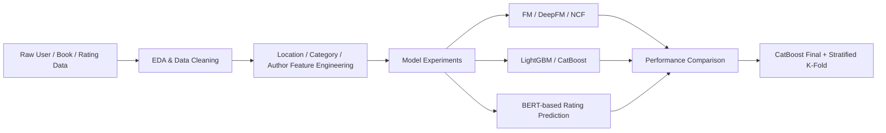
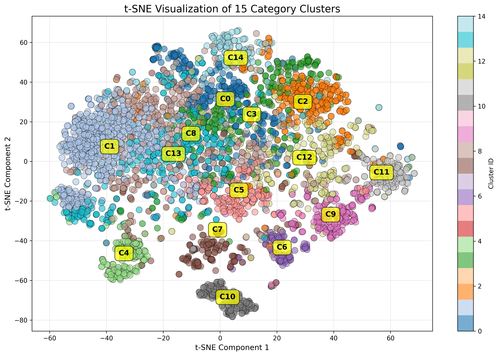

<div align="center">

# Book Rating Prediction

사용자의 도서 평점 이력을 바탕으로 평점을 예측하는 추천 시스템 프로젝트

</div>

> 네이버 부스트캠프에서 진행한 추천 시스템 프로젝트입니다.

## 1. Introduction

### 1.1. 도서 평점 예측 추천 시스템

이 프로젝트는 사용자의 도서 평점 이력을 바탕으로, 특정 사용자가 특정 도서에 얼마나 높은 평점을 줄지 예측하는 추천 시스템 프로젝트입니다.

단순한 `user-item` 상호작용만 사용하는 대신, 저자, 출판사, 카테고리, 지역, 연령대 같은 메타데이터를 함께 활용해 평점 예측 성능을 높이는 데 집중했습니다. 데이터 희소성과 범주형 피처 비중이 높은 환경에서 어떤 모델과 전처리 전략이 실제로 효과적인지 비교하고, 최종적으로 CatBoost 기반 접근을 선택했습니다.

### 1.2. Project Objective

- 도서 평점 예측 문제에 적합한 모델 구조 탐색
- 범주형 중심 데이터에서 Feature Engineering 효과 검증
- 위치 정보 정제와 통계 기반 피처를 포함한 전처리 파이프라인 구축
- CatBoost, LightGBM, FM 계열, BERT 기반 모델 비교를 통한 최종 전략 도출

### 1.3. 주요 접근

| 항목 | 설명 |
|------|------|
| 데이터 특성 | 상호작용 희소성이 높고 범주형 피처 비중이 큰 환경 |
| 핵심 전처리 | 위치 문자열 정제, 중복/이상치 처리, 통계 피처 생성 |
| 비교 모델 | FM, FFM, DeepFM, NCF, WDN, DCN, LightGBM, CatBoost, BERT |
| 최종 전략 | CatBoost + 통계 기반 피처 + Stratified K-Fold Cross Validation |

## 2. Modeling & Experiments

### 2.1. 추천 파이프라인



### 2.2. 핵심 관찰

- `지역`, `저자`, `출판사`, `카테고리`가 평점 예측에 큰 영향을 미쳤습니다.
- 희소한 범주형 데이터에서는 FM 계열보다 GBDT 계열이 더 안정적인 성능을 보였습니다.
- 모델 복잡도를 높이는 것보다, 데이터 정제와 통계 피처 추가가 더 큰 성능 개선으로 이어졌습니다.
- BERT 기반 접근은 표현력은 있었지만, 현재 데이터 환경에서는 효율이 높지 않았습니다.

### 2.3. EDA Snapshot

<p align="center"></p>

## 3. Result

### 3.1. 최종 성능

| 모델 | Private RMSE |
|------|--------------|
| CatBoost Base | 2.1409 |
| CatBoost Final | 2.1160 |

### 3.2. 결과 요약

- Stratified K-Fold Cross Validation 적용으로 기존 CatBoost 대비 약 `0.5%` 성능 향상을 확인했습니다.
- 유저, 도서, 저자별 평점 개수 피처를 추가한 뒤 CatBoost 기준 `RMSE 2.474 -> 2.1318` 수준의 개선을 확인했습니다.
- 위치 정제 파이프라인 적용 후 GeoMap 기준 유효 데이터 비율이 `City 86.5% -> 89.1%`, `State 83.9% -> 97.3%`, `Country 95.7% -> 99.9%`로 향상됐습니다.

## 4. Project Structure

```text
pro-recsys-bookratingprediction-recsys-06
├─ config/              # 모델별 실행/실험 설정
├─ src/
│  ├─ data/             # 데이터 로딩, 분할, 전처리
│  ├─ models/           # FM, DeepFM, CatBoost, BERT 등 모델 정의
│  ├─ train/            # 학습 및 추론 로직
│  ├─ loss/             # 커스텀 loss
│  └─ ensembles/        # 앙상블 유틸
├─ results/             # EDA 및 분석 결과물
├─ main.py              # 학습/추론 진입점
└─ ensemble.py          # 앙상블 실행 스크립트
```

## 5. Tech Stack

- `Python`
- `PyTorch`
- `Scikit-learn`
- `CatBoost`
- `Pandas`
- `Weights & Biases`
- `Hugging Face Transformers`

## 6. Run

### 6.1. 설치

```bash
python3 -m pip install -r requirements.txt
```

### 6.2. 학습

```bash
python3 main.py --config config/config_best.yaml
```

### 6.3. 예측

```bash
python3 main.py --config config/config_best.yaml --predict True --checkpoint saved/checkpoints/bert_best.pt
```

## 7. Team

| 이름 | 역할 |
|------|------|
| 김태형 | 팀장 |
| 김민재 | EDA, CatBoost baseline 전처리, Category/Location Feature Engineering |
| 석찬휘 | EDA, Category Feature Engineering |
| 조형동 | BERT 기반 모델 설계 및 실험 |
| 최영진 | LightGBM, CatBoost, Stratified K-Fold CV 구현 및 실험 |
